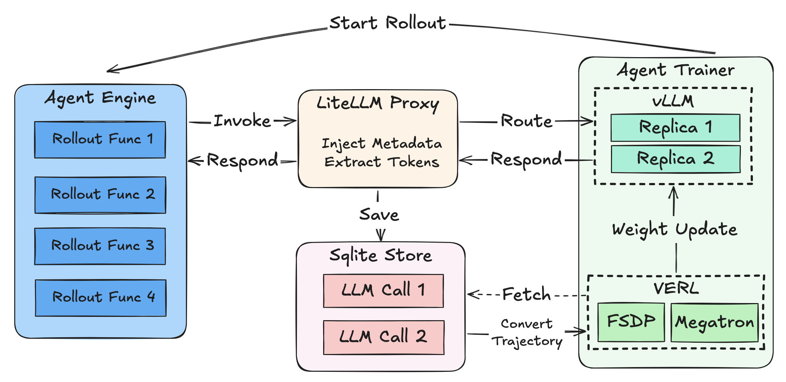

# Training Any Agentic Program with rLLM SDK

Modern RL training frameworks expect agents in a specific format—typically a simple loop with a cumulative message list and ReAct-style environment interactions. However, state-of-the-art agent architectures have evolved far beyond this:

- **Deep Research agents** use main agents that delegate to specialized sub-agents
- **LangGraph** enables complex workflows with planning, branching, and task delegation
- **Multi-agent systems** coordinate multiple LLMs with different roles

This creates a fundamental mismatch: **what's trainable ≠ what's practical to build**.

The traditional approach requires rewriting your agent to fit the training framework, which introduces:

1. **Duplicated code** - maintaining separate training and inference implementations

2. **Subtle bugs** - behavioral differences between training and production

3. **Limited architectures** - only simple agent patterns are supported

## Our Solution: Intercept LLM Calls, Not Agent Structure

Instead of constraining how you build agents, we intercept the LLM calls themselves. This means:

✅ **Use any agent framework** - LangChain, LangGraph, AutoGen, or custom python code  
✅ **No code changes for training** - your agent runs exactly as written  
✅ **Exact train/inference parity** - what the model sees is identical in both modes

### The Key Insight: Tokens In, Tokens Out

The critical challenge in agent RL training is **retokenization mismatch**. When you:
1. Generate text with Model A
2. Retokenize for training

you can get different token sequences due to tokenizer edge cases, leading to off-policy data that destabilizes training.

**Example**: The text `" Pantom"` can be tokenized as either `[53122, 316]` or `[393, 30002]` depending on context. If the model generated `[53122, 316]` during inference but training retokenizes to `[393, 30002]`, the model is now being trained on tokens it never produced—causing reward collapse and unstable training.

Our solution: **capture token IDs directly from the inference server** (vLLM), store them, and use them directly for training. No retokenization ever occurs.

---

## System Architecture



### Data Flow Summary

1. **Rollout Phase**: The Agent Execution Engine manages orchestration of parallel rollout of your agent function, which makes LLM calls via the SDK client, this invokes the litellm proxy to capture the token ids and optionally logprobs.
2. **Capture Phase**: The LiteLLM based proxy intercepts calls, injects metadata, fetches token IDs and logprobs directly from vLLM. And finally stores all relevant information to the SQLite Store.
3. **Collection Phase**: The Agent Trainer fetches LLM calls directly from the SQLite Store, groups by `rollout_id`, and transform to `Trajectory` objects that's compatible with the trainer.
4. **Training Phase**: The Agent Trainer leverages the tokenized data, computes advantages and updates model weights.

---

## Quick Start

### 1. Define Your Agent Function

The simplest way to get started: write a function that takes task inputs, makes LLM calls, and returns a reward.

```python
from rllm.sdk import get_chat_client

def my_agent(question: str, ground_truth: str, **kwargs) -> float:
    """Your agent function - this is what gets trained."""
    
    # Create traced client INSIDE the function
    client = get_chat_client(
        base_url="http://localhost:4000/v1",
        api_key="EMPTY"
    )
    
    # Make LLM calls - automatically traced!
    response = client.chat.completions.create(
        model="Qwen/Qwen3-4B",
        messages=[{"role": "user", "content": question}]
    )
    
    # Compute and return reward
    answer = response.choices[0].message.content
    reward = 1.0 if ground_truth.lower() in answer.lower() else 0.0
    return reward
```

**That's it!** Pass this function to `AgentTrainer` and training begins. See [SDK Math Agent](../examples/sdk_math.md) for a complete example.

### 2. Multi-Step Agents with `@trajectory`

A **trajectory** is a sequence of LLM calls that form a complete agent interaction—whether single-step or multi-step. For agents with multiple LLM calls where you want per-step rewards, use the `@trajectory` decorator:

```python
from rllm.sdk import get_chat_client_async, trajectory

@trajectory(name="solver")
async def solve_with_search(question: str):
    """Each LLM call becomes a step in the trajectory."""
    client = get_chat_client_async(base_url="http://localhost:4000/v1")
    
    # Step 1: Plan
    plan = await client.chat.completions.create(
        model="Qwen/Qwen3-4B",
        messages=[{"role": "user", "content": f"Plan how to solve: {question}"}]
    )
    
    # Step 2: Execute
    answer = await client.chat.completions.create(
        model="Qwen/Qwen3-4B", 
        messages=[
            {"role": "user", "content": f"Plan: {plan.choices[0].message.content}"},
            {"role": "user", "content": "Now solve it."}
        ]
    )
    
    return answer.choices[0].message.content

# Returns TrajectoryView with all steps captured
traj = await solve_with_search("What is the capital of France?")

# Assign per-step rewards
traj.steps[0].reward = 0.5  # Partial credit for planning
traj.steps[1].reward = 1.0  # Full credit for answer
traj.reward = 1.0  # Overall trajectory reward
```

---

## Advanced: Fine-Grained Session Control

A **session** is a context that groups LLM calls together for a single task or rollout. Each LLM call within a session produces a **trace** containing the exact token IDs (prompt and completion), log probabilities, original messages, and metadata.

For most use cases, the automatic session management is sufficient. However, if you need explicit control over tracing, you can use sessions directly.

### When to Use Explicit Sessions

| Use Case | Recommendation |
|----------|----------------|
| single-turn agent | ❌ Not needed |
| multi-turn agent with outcome reward | ❌ Not needed |
| multi-turn agent with per-step reward | ✅ Use explicit sessions or @trajectory |
| Custom metadata per LLM call | ✅ Use explicit sessions |
| Debugging trace capture | ✅ Use explicit sessions |

### Explicit Session Usage

```python
from rllm.sdk import session, get_chat_client

client = get_chat_client(base_url="http://localhost:4000/v1")

# Manually manage session for custom metadata
with session(experiment="v1", task_id="math_001", difficulty="hard") as sess:
    response = client.chat.completions.create(
        model="Qwen/Qwen3-4B",
        messages=[{"role": "user", "content": "What is 2+2?"}]
    )
    
    # Access captured traces directly
    print(f"Captured {len(sess.llm_calls)} LLM calls")
    print(f"Token IDs: {sess.llm_calls[0]['output']['prompt_token_ids']}")
```

### Nested Sessions

Sessions can be nested for hierarchical agent structures:

```python
with session(experiment="v1"):
    with session(task="math", difficulty="hard"):
        # This call gets merged metadata: 
        # {experiment: "v1", task: "math", difficulty: "hard"}
        client.chat.completions.create(...)
```

### Using with LangGraph

For LangGraph workflows, use explicit sessions when you need fine control:

```python
from langgraph.graph import StateGraph, MessagesState
from rllm.sdk import get_chat_client, session

client = get_chat_client(base_url="http://localhost:4000/v1")

async def agent_step(state: MessagesState):
    response = await client.chat.completions.create(
        model="Qwen/Qwen3-4B",
        messages=state["messages"]
    )
    return {"messages": [response.choices[0].message]}

workflow = StateGraph(MessagesState)
workflow.add_node("agent", agent_step)
# ... add edges, compile ...
graph = workflow.compile()

# Explicit session for custom tracking
with session(task_id="hotpotqa_001", max_turns=5):
    result = await graph.ainvoke({"messages": [...]})
```

For a complete LangGraph training example, see [Tutorial 3: LangGraph RAG Agent](../examples/sdk_langgraph_rag.md).

---

## How It Works Under the Hood

When you pass your agent function to `AgentTrainer`, it will automatically:

1. **Wraps each call in a session** - You don't need to manage sessions manually
2. **Captures all LLM calls** - Every `client.chat.completions.create()` is captured and stored to the SQLite Store.
3. **Groups traces by task** - All LLM calls in the rollout becomes a trajectory ready for training.

```python
from rllm.trainer.agent_trainer import AgentTrainer

trainer = AgentTrainer(
    config=config,
    agent_run_func=my_agent,  # Your function from above
    train_dataset=train_data,
    val_dataset=val_data,
)
trainer.train()
```

> **💡 Key insight**: The engine executes your function like this internally:
> ```python
> with session(task_id=task["uid"]):
>     reward = await my_agent(**task)
> ```
> You get session benefits without writing session code.

---


## Tutorials

We provide three hands-on tutorials that progressively introduce more complex agent patterns:

| Tutorial | Complexity | What You'll Learn |
|----------|------------|-------------------|
| **[Simple Math Agent](../examples/sdk_math.md)** | Beginner | Basic `get_chat_client()`, single-step rollouts, `AgentTrainer` setup |
| **[Solver-Judge Workflow](../examples/sdk_solver_judge.md)** | Intermediate | `@trajectory` decorator, multi-agent composition, per-agent reward assignment |
| **[LangGraph RAG Agent](../examples/sdk_langgraph_rag.md)** | Advanced | Client injection into LangChain, multi-turn tracing, tool-using agents |

---

## References

- [Retokenization issues in RL training](https://wandb.ai/tianhaowu/rllm-agent/reports/Tokenization-Mismatch-in-Text-Level-Operations--VmlldzoxNDg0MTcwMw)
- [VERL: Distributed RL Training](https://github.com/volcengine/verl)
- [LiteLLM Proxy](https://docs.litellm.ai/docs/proxy/quick_start)