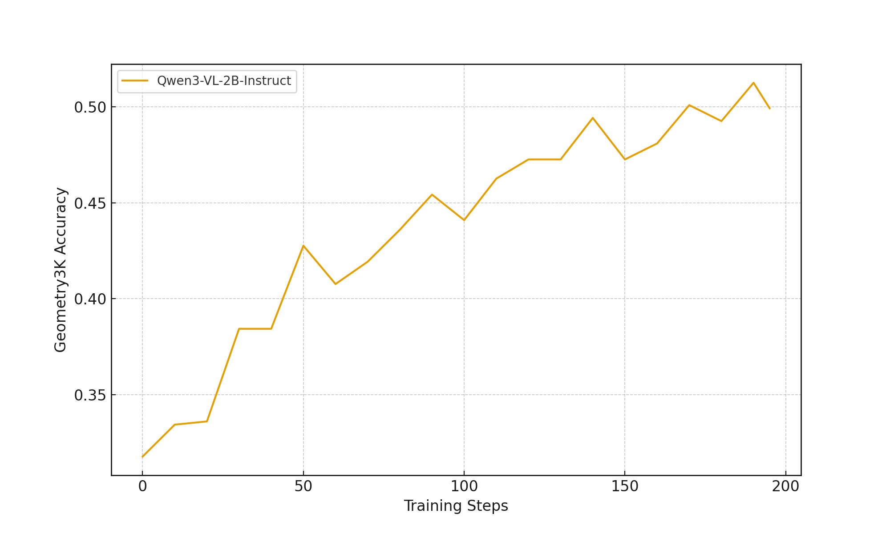

# Vision-Language Model (VLM) Training Example

This example demonstrates how to train **Vision-Language Models** (VLMs) using rLLM's workflow framework and VeRL's backend. We use the Geometry3K dataset to train a multimodal agent that can solve geometry problems by reasoning over both images and text.

## Overview

The VLM training example demonstrates:

- How to implement multimodal workflows that process both images and text
- How to integrate VLMs with rLLM's training pipeline
- How to evaluate multimodal reasoning performance on mathematical tasks

## Quick Start

### Model Hosting

Start a vLLM or SGLang server for a vision-language model:

```bash
CUDA_VISIBLE_DEVICES=0 python -m sglang.launch_server \
    --model-path Qwen/Qwen3-VL-2B-Instruct \
    --host 0.0.0.0 \
    --port 30000
```

The server should be accessible at http://localhost:30000/v1

### Dataset Preparation

Prepare the Geometry3K dataset:

```bash
cd examples/geo3k
python preprocess_geo3k.py
```

This will:

- Download the `hiyouga/geometry3k` dataset from HuggingFace
- Process geometry problems with images and text
- Register the dataset with rLLM's DatasetRegistry
- Save processed data for training and evaluation

### Run VLM Agent

Execute the VLM agent on geometry problems:

```bash
cd examples/geo3k
python run_geo3k.py
```

This will:

- Load the Geometry3K test dataset
- Run the VLM workflow on each problem
- Evaluate performance using pass@1 and pass@k metrics
- Save results to `logs/geo3k.json`

### Train VLM Agent

Train your own VLM agent using reinforcement learning:

```bash
cd examples/geo3k
bash train_geo3k.sh
```

**Training Configuration:**

- Base model: `Qwen/Qwen3-VL-2B-Instruct`
- Algorithm: GRPO (Group Relative Policy Optimization)
- Training batch size: 32
- Response length: Up to 2048 tokens
- Number of GPUs: 8 (configurable)
- Training epochs: 3

**Results:**


## Code Reference

### VLM Workflow Implementation

The multimodal workflow that handles image and text inputs:

```python title="examples/geo3k/geo3k_workflow.py"
--8<-- "examples/geo3k/geo3k_workflow.py"
```

### Dataset Preprocessing

Script for preparing the Geometry3K dataset:

```python title="examples/geo3k/preprocess_geo3k.py"
--8<-- "examples/geo3k/preprocess_geo3k.py"
```

### Evaluation Script

Main script for running the VLM workflow:

```python title="examples/geo3k/run_geo3k.py"
--8<-- "examples/geo3k/run_geo3k.py"
```

### Training Script

Training configuration using the VLM workflow:

```python title="examples/geo3k/train_geo3k.py"
--8<-- "examples/geo3k/train_geo3k.py"
```