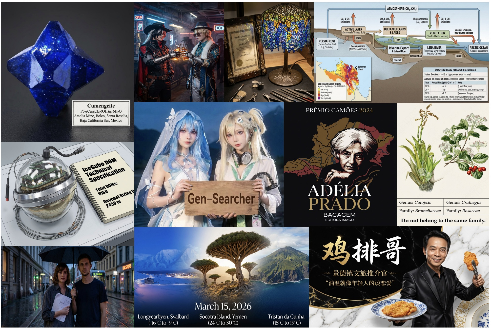
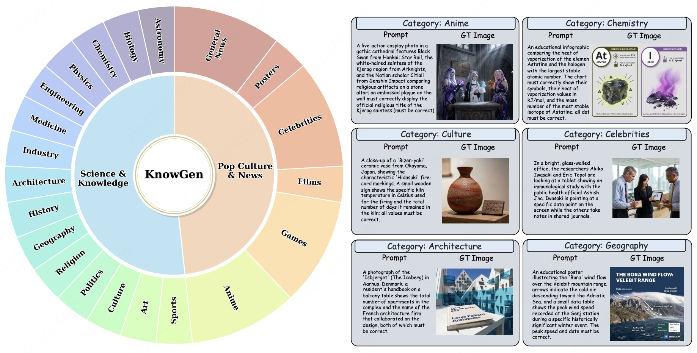
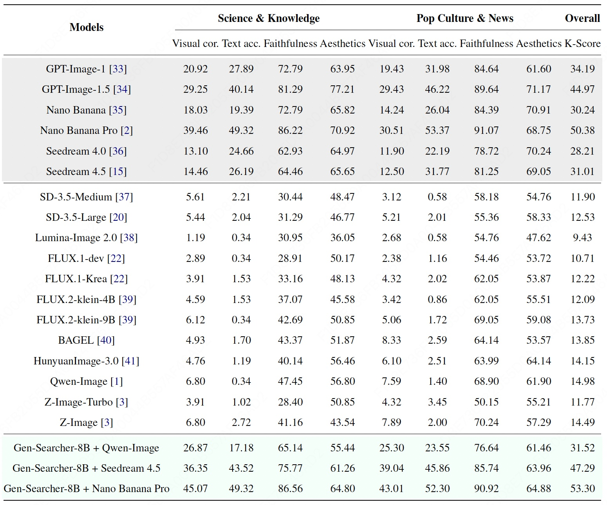
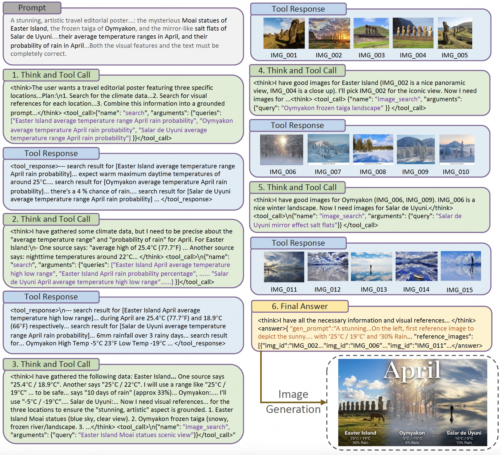

<div align="center">
  
</div>

<h1 align="center"> Reinforcing Agentic Search for Image Generation</a></h1>


<p align="center">
  <a href="https://gen-searcher.vercel.app/">[🌐 Project Page]</a> &nbsp;&nbsp;
  <a href="https://arxiv.org/pdf/2603.28767">[📖 Paper]</a>
</p>


<p align="center">
  <a href="https://huggingface.co/GenSearcher/Gen-Searcher-8B">[🤗 GenSearcher-8B-model]</a> &nbsp;&nbsp;
  <a href="https://huggingface.co/GenSearcher/Gen-Searcher-SFT-8B">[🤗 SFT-model]</a> &nbsp;&nbsp;
  <a href="https://huggingface.co/datasets/GenSearcher/Train-Data">[🤗 GenSearcher-train-data]</a> &nbsp;&nbsp;
  <a href="https://huggingface.co/datasets/GenSearcher/KnowGen-Bench">[🤗 KnowGen-Bench]</a>
</p>


# 👀 Intro

<div align="center">
  
</div>

We introduce **Gen-Searcher**, as the first attempt to train a multimodal **deep research agent** for image generation that requires complex real-world knowledge. Gen-Searcher can **search the web, browse evidence, reason over multiple sources, and search visual references** before generation, enabling more accurate and up-to-date image synthesis in real-world scenarios.

We build two dedicated training datasets **Gen-Searcher-SFT-10k**, **Gen-Searcher-RL-6k** and one new benchmark **KnowGen** for search-grounded image generation. 

Gen-Searcher achieves significant improvements, delivering **15+ point gains on the KnowGen and WISE benchmarks**. It also demonstrates **strong transferability** to various image generators.

All code, models, data, and benchmark are fully released.


## 🔥 News

- [2026/03/30] We release the code, model, data of Gen-Searcher

  

## 🔍 KnowGen-Bench

Our KnowGen bench covers around 20 diverse categories in real-world scenarios.

<div align="center">
  
</div>

## 🏆 Performance

Our method delivers consistent gains across backbones, improving Qwen-Image by around **16 points** on KnowGen. It also shows strong transferability, generalizing to Seedream 4.5 and Nano Banana Pro with no additional training, yielding about 16-point and 3-point improvements, respectively.

<div align="center">
  
</div>

## 🎥 Demo

#### Inference Process Example

<div align="center">
  
</div>

#### Application Demo

For more examples, please refer to our website [[🌐Project Page]](https://gen-searcher.vercel.app/) 

<div align="center">
  
  
</div>


## 🚀 Training

#### Setup

```bash
# 1. Clone the repository
git https://github.com/tulerfeng/Gen-Searcher.git
cd Gen-Searcher

# build SFT environment
conda create -n llamafactory python=3.11 
conda activate llamafactory
cd Gen-DeepResearch-SFT/LLaMA-Factory
pip install -e ".[torch,metrics]" --no-build-isolation

# build RL environment
conda create -n genrl python=3.11 
conda activate genrl
cd Gen-DeepResearch-RL

# Install verl
cd rllm/verl
pip install -e .

# Install rllm
cd ../rllm
pip install -e .

# Install diffusers
pip install diffusers
# Finally, install the sglang and vllm
```

Download the dataset from Hugging Face and unzip all files. Then update the image paths in the JSON file to match your local directory.

#### SFT Training

Our SFT training simply follow [LLaMA-Factory](https://github.com/hiyouga/LlamaFactory), using our `sft_data.json`

```bash
cd Gen-DeepResearch-SFT/LLaMA-Factory/examples/train_full
llamafactory-cli train gen_qwen3_sft.yaml
```

 A minimum of 8 × 80GB GPUs is required for SFT training  based on [Qwen/Qwen3-VL-8B-Instruct](https://huggingface.co/Qwen/Qwen3-VL-8B-Instruct).

#### RL Training

First, register the `rl_data.json` dataset

```bash
cd Gen-DeepResearch-RL/rllm/vision_deepresearch_async_workflow/data_prepare
bash register_gen_rl_dataset.sh
```

Launch the webpage summary model for the  `browse` tool, here we use [Qwen/Qwen3-VL-30B-A3B-Instruct](https://huggingface.co/Qwen/Qwen3-VL-30B-A3B-Instruct)

```
cd Gen-DeepResearch-RL/rllm/vision_deepresearch_async_workflow/run
bash serve_summary_model_vllm.sh
```

Launch the image generator for rollout generation, here we use [Qwen/Qwen-Image-Edit-2509](https://huggingface.co/Qwen/Qwen-Image-Edit-2509) with FastAPI for serving. 

```
cd qwen_image_api_server/run_server.bash
bash run_server.bash
```

You may also change to other image generators by simply revising `qwen_image_api_server/qwen-image-edit/api.py`

Then, set the launched URL serve endpoints for `QWEN_EDIT_APP_URL` and `BROWSE_SUMMARY_BASE_URL` in`.env.gen_image`, and enter your `SERPER_KEY_ID`, `JINA_API_KEYS` and `GEN_REWARD_API_KEY` 

It is worth noting that, for open-source release, we replace our original `search` and `image_search` tools with the public Serper service. As a result, there may be a performance gap due to differences between the tools. You may also adapt it to your own tools by revising `./rllm/vision_deepresearch_async_workflow/tools`

Finally, start the RL training based on the SFT model.

```bash
cd Gen-DeepResearch-RL/rllm/vision_deepresearch_async_workflow/run
bash gen_image_deepresearch_8B_fsdp_8gpu.sh
```

 A minimum of 4 × 80GB GPUs is required for RL training.

## 🔮 Inference

Download the [🤗 [KnowGen-Bench](https://huggingface.co/datasets/GenSearcher/KnowGen-Bench)], or you may use your own data by setting the same json format. For inference, you also need to properly set the tools and launch the summary model aforementioned.

Serve the trained model

```
cd Gen-DeepResearch-RL/rllm/vision_deepresearch_async_workflow/run
bash serve_infer_model_vllm.sh
```

Run the inference script for deep agentic search.

```
cd Gen-DeepResearch-RL/rllm/eval
bash run_gen_image_eval.sh
```

Run the generation script for the final image generation based on the search-grounded results

```
bash run_gen_image_from_results.sh
```

## 📐 KnowGen Bench Evaluation

Unzip all files in the KnowGen benchmark.

Set the OpenAI API key and run

``` bash
cd KnowGen_Eval
bash gpt_eval_knowgen.sh
```

If you have correctly run the previous agentic inference on KnowGen, the result JSON and generated images should already be properly saved. You only need to ensure that `RESULTS_JSON` points to the same path as the inference results.

Otherwise, if you use images generated by other methods on KnowGen, you can organize them in the following format for evaluation.

```bash
  [
    {
      "id": 3260,
      "success": true,
      "prompt": "xxxxx",
      "meta": { "category": "Biology", "difficulty": "easy" },
      "output_path": "./images/output_3260.png", # Generated image path
      "gt_image": "./gt_image/answer_3260.png" # Ground truth image path
    }
  ]

```


## Acknowledgements

We sincerely appreciate the contributions of the open-source community. The related projects are as follows:  [verl](https://github.com/volcengine/verl),  [LLaMA-Factory](https://github.com/hiyouga/LLaMA-Factory),  [Vision DeepResearch](https://github.com/Osilly/Vision-DeepResearch), [rllm](https://github.com/rllm-org/rllm)

## Citations

If you find our work helpful for your research, please consider citing our work.   

```
@article{feng2026gen,
  title={Gen-Searcher: Reinforcing Agentic Search for Image Generation},
  author={Feng, Kaituo and Zhang, Manyuan and Chen, Shuang and Lin, Yunlong and Fan, Kaixuan and Jiang, Yilei and Li, Hongyu and Zheng, Dian and Wang, Chenyang and Yue, Xiangyu},
  journal={arXiv preprint arXiv:2603.28767},
  year={2026}
}

@article{chen2026unify,
  title={Unify-Agent: A Unified Multimodal Agent for World-Grounded Image Synthesis},
  author={Chen, Shuang and Shou, Quanxin and Chen, Hangting and Zhou, Yucheng and Feng, Kaituo and Hu, Wenbo and Zhang, Yi-Fan and Lin, Yunlong and Huang, Wenxuan and Song, Mingyang and others},
  journal={arXiv preprint arXiv:2603.29620},
  year={2026}
}
```
